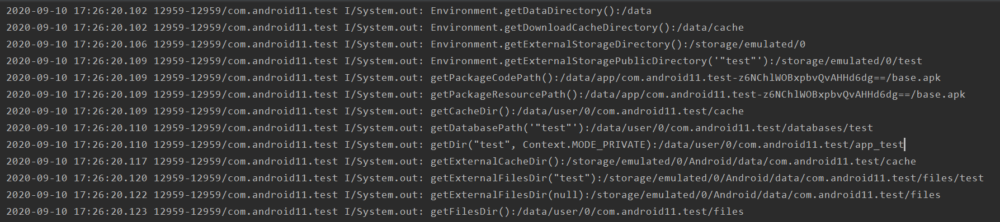

# 文件目录

```

		System.out.println("Environment.getDataDirectory():"+ Environment.getDataDirectory())
        System.out.println("Environment.getDownloadCacheDirectory():"+ Environment.getDownloadCacheDirectory())
        System.out.println("Environment.getExternalStorageDirectory():"+ Environment.getExternalStorageDirectory())
        System.out.println("Environment.getExternalStoragePublicDirectory('\"test\"'):"+ Environment.getExternalStoragePublicDirectory("test"))
        System.out.println("getPackageCodePath():"+ context?.getPackageCodePath())
        System.out.println("getPackageResourcePath():"+ context?.getPackageResourcePath())
        System.out.println("getCacheDir():"+ context?.getCacheDir())
        System.out.println("getDatabasePath('\"test\"'):"+ context?.getDatabasePath("test"))
        System.out.println("getDir(\"test\", Context.MODE_PRIVATE):"+ context?.getDir("test", Context.MODE_PRIVATE))
        System.out.println("getExternalCacheDir():"+ context?.getExternalCacheDir())
        System.out.println("getExternalFilesDir(\"test\"):"+ context?.getExternalFilesDir("test"))
        System.out.println("getExternalFilesDir(null):"+ context?.getExternalFilesDir(null))
        System.out.println("getFilesDir():"+ context?.getFilesDir())
```

请求结果
